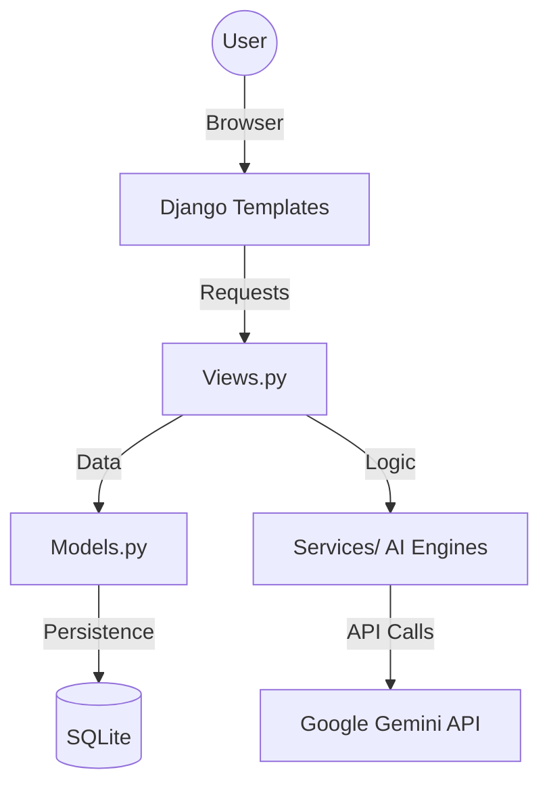

# Smart Health - Technical Documentation

## 1. Project Overview
**Smart Health** is an AI-integrated healthcare platform built with Django. It empowers users to monitor their health through metrics analysis, medical report decoding (AI Vision), and personalized lifestyle recommendations generated by Large Language Models (LLMs).

## 2. Technical Stack
- **Web Framework**: [Django 5.2.5](https://www.djangoproject.com/)
- **Programming Language**: Python 3.10+
- **Database**: SQLite (default), extensible to PostgreSQL/MongoDB.
- **AI Integration**: [Google Gemini Pro](https://ai.google.dev/) (Generative AI & Vision)
- **Frontend**: Django Templates, Bootstrap 5, Custom CSS (Glassmorphism design).
- **Email Service**: SMTP (Gmail integration).

## 3. System Architecture
The application follows the standard Django MVT (Model-View-Template) pattern, with an additional **Services Layer** to handle complex AI logic.



## 4. Database Schema (Models)
The core data structure is defined in `healthapp/models.py`:

- **HealthProfile**: Stores primary user vitals like Age, BMI, Blood Pressure, and Sugar levels.
- **MedicalReport**: Handles file uploads (PDF/Image) and stores AI-extracted insights and structured health plans.
- **UserActivityTrack**: Manages daily streaks for workouts, diets, and medication.
- **BMIRecord**: Historical tracking of Body Mass Index.
- **Feedback**: Collects user queries and suggestions.

## 5. Core Services (Logic Layer)
Located in `healthapp/services/`, these modules handle the heavy lifting:

- **`report_analyzer.py`**: Uses Gemini Vision to parse uploaded medical reports and extract structured data.
- **`plan_service.py`**: Generates customized diet and exercise plans based on user profiles.
- **`health_analyzer.py`**: Calculates the holistic health score (0-100) and risk assessments.
- **`medicine_service.py`**: Provides informational details about various medications.
- **`motivation_service.py`**: Delivers daily AI-powered motivational content.

## 6. Setup & Configuration
### Prerequisites
- Python 3.10+ installed.
- A Google Gemini API Key.

### Environment Variables (`.env`)
Create a `.env` file in the root directory with the following:
```env
GEMINI_API_KEY=your_gemini_api_key
EMAIL_USER=your_gmail@gmail.com
EMAIL_PASS=your_app_password
```

### Installation
1. Clone the repository.
2. Install dependencies:
   ```bash
   pip install django djangorestframework google-generativeai python-dotenv
   ```
3. Run migrations:
   ```bash
   python manage.py migrate
   ```
4. Start the server:
   ```bash
   python manage.py runserver
   ```

## 7. Key API/URL Endpoints
- `/`: Dashboard (BMI Tracking)
- `/health-profile/`: Vitals Entry & Assessment
- `/reports/`: Medical Report AI Analysis
- `/health-plans/`: Personalized Routines
- `/medicine-analyzer/`: Pharmaceutical Info
